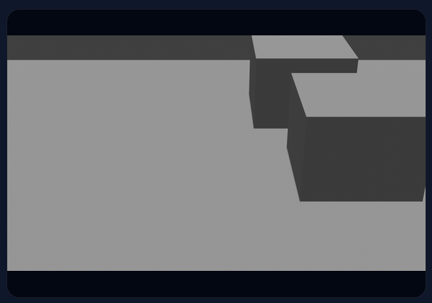
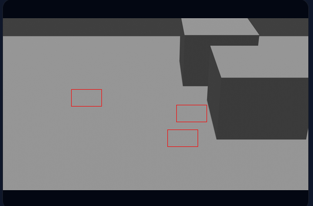

# SynthShield

Synthetic data pipeline for generating labeled training data for computer vision systems without using real-world sensitive data.

Built in 24 hours at RevolutionUC.

---

## 🖥️ Demo

👉 https://synthshield.tech

Generate synthetic scenes and view automatically labeled outputs.

---

## 🚀 Overview

SynthShield generates realistic synthetic images and automatically produces annotations for training object detection models.

This enables safe, scalable development of AI systems in domains where real data is limited or sensitive.

---

🧰 Technical Stack

Languages

Python
JavaScript
HTML / CSS

Frameworks & Libraries

Flask (backend API)
Web-based frontend (vanilla JS)

Tools & Platforms

Blender (synthetic scene generation)
YOLO annotation format (bounding box labeling)
GitHub (version control)
Vercel (deployment)

Core Concepts

Synthetic data generation
Computer vision annotation pipelines
Procedural scene randomization
Privacy-preserving AI

## 🎯 Alignment with Kinetic Vision Challenge

This project directly satisfies the challenge requirements:

* ✅ Synthetic RGB scene generation
* ✅ Automatic annotation generation (YOLO format)
* ✅ Scene variability and randomization
* ✅ Automated data generation pipeline

Stretch Goals:

* ⚡ Bounding box annotations implemented
* 🔜 Instance segmentation and mask generation (future work)
* 🔜 Model training integration (YOLO)

---

## 📸 Example Outputs

| Raw Scene              | Annotated Output                   |
| ---------------------- | ---------------------------------- |
|  |         |

These examples demonstrate the end-to-end pipeline: synthetic scene generation followed by automatic annotation without manual labeling.
---

## 📦 Data Generated Per Scene

Each generated scene produces:

* RGB synthetic image
* YOLO-format bounding box annotations
* (Future) segmentation masks
* (Future) object classification labels

---

## 🔄 Scene Variability

To improve model robustness, each scene includes:

* Random object placement
* Variable object counts
* Camera angle variation
* Lighting changes
* Background diversity

Each generated scene is unique, with different object positions, counts, and configurations across runs.
---

## ⚙️ Pipeline

1. Generate synthetic scene (3D environment)
2. Randomize objects, lighting, and camera
3. Extract object metadata
4. Convert to YOLO bounding box format
5. Output:
   
   * Image
   * Annotation file

---

## ⚙️ Automated Data Generation

* Fully automated pipeline
* No manual labeling required
* Scalable to thousands of images

---

## ⚡ Efficiency

* Scenes generated in seconds
* Eliminates costly manual annotation
* Rapid dataset creation for model training

---

## 🧩 Extensibility

* Add new 3D objects
* Support new environments
* Extend annotation formats
* Integrate with training pipelines

---

## 👨‍💻 Developer Experience

* Simple, modular pipeline
* Easy to extend and modify
* Clear separation of generation and labeling

---

## 🔐 Security & Privacy Value

SynthShield enables development of AI systems without:

* Using sensitive real-world data
* Violating privacy regulations
* Exposing real environments

Applicable to:

* Surveillance systems
* Healthcare imaging
* Defense and security AI

---

## 🚀 Future Work

* Instance segmentation masks
* YOLO model training integration
* Increased scene realism
* Large-scale dataset generation

